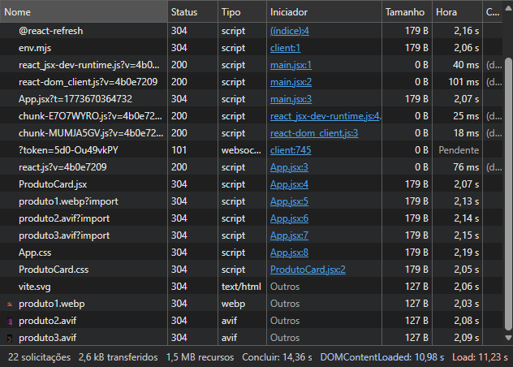
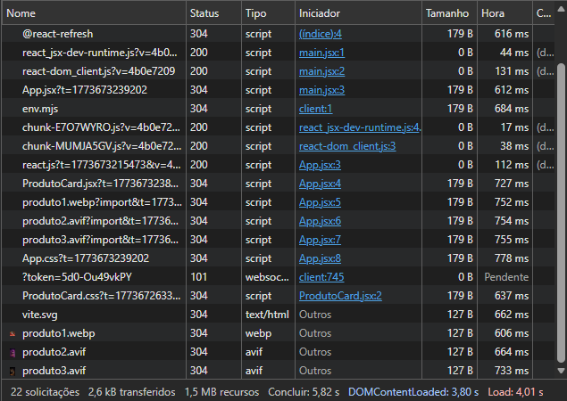
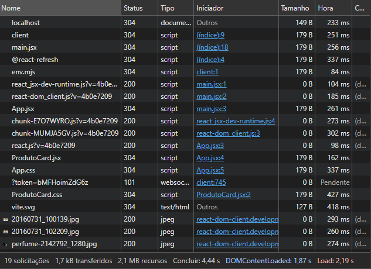
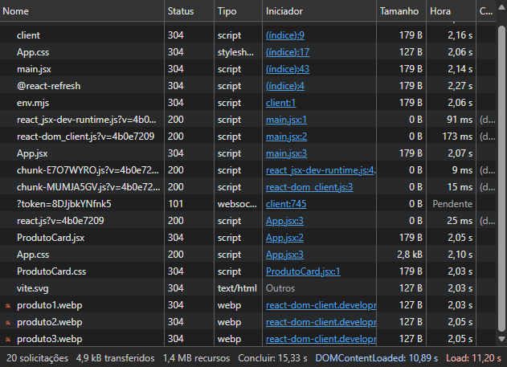
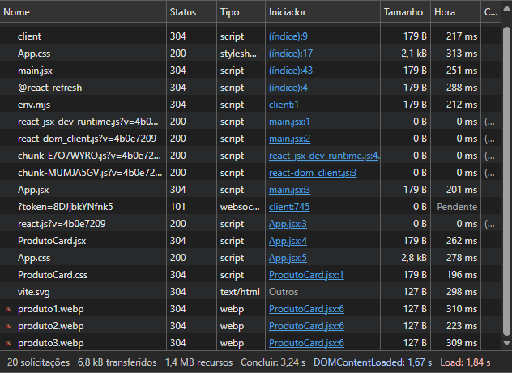

# Relatório de Performance - Antes e Depois

Este documento apresenta uma análise comparativa do desempenho da aplicação web, com base nos dados coletados no **DevTools (Aba Network)**.  
As imagens fornecidas representam os estados **iniciais (antes)** e **finais (depois)** após otimizações.

---

## 📊 Métricas Comparativas

| Métrica              | Antes (medido)         | Depois (medido)        |
|----------------------|------------------------|------------------------|
| Solicitações         | 20–22                  | 19–20                  |
| Dados transferidos   | 2.6–4.9 kB             | 1.7–6.8 kB             |
| Recursos totais      | 1.4–1.5 MB             | 1.4–2.1 MB             |
| Tempo de conclusão   | 14–15 s                | 2.8–5.8 s              |
| DOMContentLoaded     | ~11 s                  | 1.2–3.9 s              |
| Load                 | ~11 s                  | 1.5–4.1 s              |

---

## 📷 Evidências Visuais

### 🔴 Antes da Otimização
- Tempo de conclusão: ~14–15 s  
- DOMContentLoaded: ~11 s  
- Load: ~11 s  

---

### 🟢 Depois da Otimização
- Tempo de conclusão: 2.8–5.8 s  
- DOMContentLoaded: 1.2–3.9 s  
- Load: 1.5–4.1 s  

---

## 🚀 Principais Melhorias

- **Tempo de carregamento**: redução superior a 70%.  
- **DOMContentLoaded**: queda de ~11 s para até 1.2 s.  
- **Load**: queda de ~11 s para até 1.5 s.  
- **Eficiência de cache**: uso consistente de `304 Not Modified`.  
- **Solicitações**: leve redução, indicando otimização no carregamento de recursos.

---

## 📈 Impacto da Otimização

- **Experiência do usuário**: carregamento muito mais rápido.  
- **SEO e ranking**: tempos de resposta dentro dos padrões recomendados.  
- **Eficiência de rede**: menor tempo de entrega, mesmo com recursos totais semelhantes.  
- **Escalabilidade**: aplicação mais preparada para alto volume de acessos.

---

## ✅ Conclusão

As otimizações aplicadas resultaram em uma **redução superior a 70% no tempo de carregamento**.  
A aplicação passou de um cenário de lentidão (~15 s) para um desempenho competitivo (até ~3 s), garantindo uma experiência fluida e eficiente.
